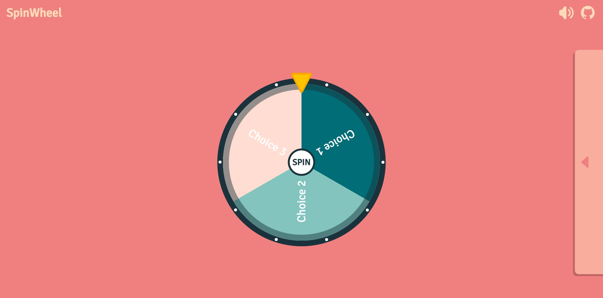
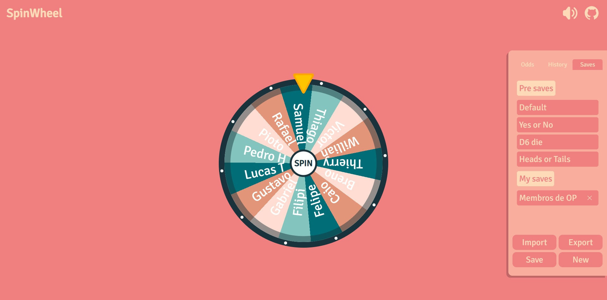
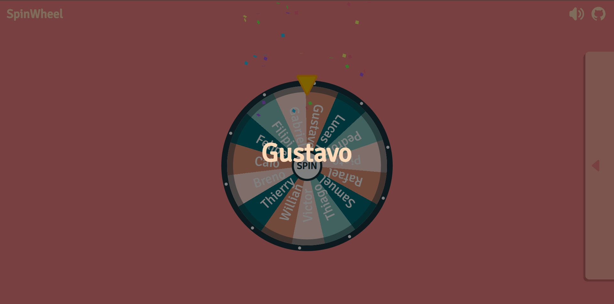

# SpinWheel

Uma aplicação web interativa para criar, personalizar e girar uma roleta de decisões com estilo. O projeto foi desenvolvido em React e oferece uma experiência simples, visual e divertida para sortear opções, definir probabilidades e salvar rodas personalizadas para uso posterior.

[](https://react.dev)
[](https://developer.mozilla.org/pt-BR/docs/Web/JavaScript)
[](https://create-react-app.dev)
[](https://pages.github.com)

> Projeto pessoal com foco em experiências interativas, controle visual de probabilidades e persistência de dados no navegador.

---

## 📸 Screenshots





---

## ✨ Funcionalidades

- Girar a roleta com animação, efeitos sonoros e efeito de confete ao final
- Ajustar porcentagens dos segmentos diretamente na interface
- Adicionar e remover opções da roleta dinamicamente
- Personalizar textos, cores e destaque visual de cada segmento
- Visualizar o histórico dos resultados sorteados
- Salvar, importar e exportar rodas personalizadas
- Utilizar rodas pré-definidas como exemplo (ex.: Sim/Não, D6, Cara/Coroa)
- Manter o estado entre recarregamentos via localStorage

---

## 🧩 Arquitetura e estrutura principal

O projeto é organizado em torno da página principal da roleta e de componentes reutilizáveis:

| Componente | Descrição |
|------------|-----------|
| [`src/pages/SpinWheel.js`](src/pages/SpinWheel.js) | lógica principal da roleta, animação, histórico e abertura de modais |
| [`src/components/Odds.js`](src/components/Odds.js) | painel de edição dos segmentos, probabilidades, histórico e salvamento |
| [`src/components/Save.js`](src/components/Save.js) | formulário para salvar uma nova roda |
| [`src/components/Modal.js`](src/components/Modal.js) | componente de modal reutilizável |
| [`src/components/Winner.js`](src/components/Winner.js) | exibição do resultado vencedor |
| [`src/data/wheelsData.js`](src/data/wheelsData.js) | rodas préconfiguradas para uso rápido |
| [`src/hooks/useAudio.js`](src/hooks/useAudio.js) | controle de áudio da animação |

---

## ▶️ Como executar localmente

### Pré-requisitos

- Node.js instalado
- npm ou yarn

### Passos

1. Clone o repositório:
   ```bash
   git clone https://github.com/ccostafrias/spin-wheel.git
   cd spin-wheel
   ```

2. Instale as dependências:
   ```bash
   npm install
   ```

3. Inicie o projeto em modo de desenvolvimento:
   ```bash
   npm start
   ```

4. Abra no navegador:
   ```text
   http://localhost:3000
   ```

---

## 🏗️ Build e deploy

Para gerar uma versão de produção:

```bash
npm run build
```

Para publicar na GitHub Pages:

```bash
npm run deploy
```

---

## 📦 Scripts disponíveis

- `npm start` — inicia o ambiente de desenvolvimento
- `npm run build` — cria a build de produção
- `npm run deploy` — publica a build no GitHub Pages

---

Made with 🤍 by Caique C.